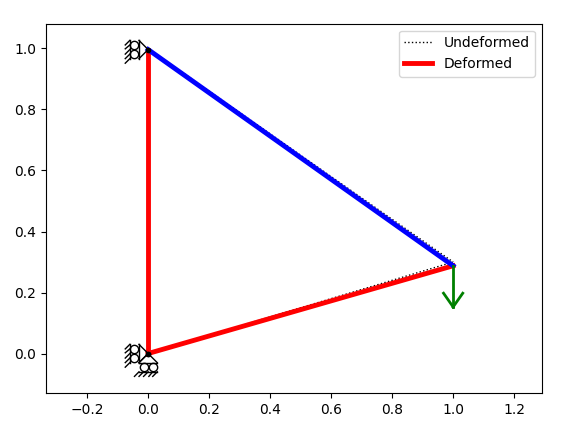

# FEM-Python


## Day 0: Handout
This is the code that is intended for handout on the first day.

### Installation
We suggest to run the code in the Visual Studio Code environment.

The necessary packages can be installed by executing the following commands in the terminal:

```
python -m pip install numpy
python -m pip install matplotlib
python -m pip install scipy
```

### Code structure

The code is built as close as possible to the basic Matlaab code used in the course. One difference is that the code must be run by the `driver.py` file, which calls the finite element analysis class located in `src/fea.py` called **Fea**. Two other subroutines are called for plotting loads and supports `src/plotloads.py` and `src/plotsupports.py`.

The idea is that almost all changes to the code needs to be made in the **Fea** class.

>**IMPORTANT:** The input files for the FEA are the same Matlab files used in the Matlab implementation of the course and may be generated manually or by the mesh generation software `Flextract` (see e.g. `example1.m` or `test1.m`). Remark that all FE numbering, c.f. node and element numbering, is kept in "standard" numbering format (starting with one) in MATLAB and thus some care must be taken when building the FE vectors and Matrices in Python that start from zero.  

### Displaying results
After solving the mandatory exercises for Day 1, the code will be able solve linear elastic problems and plot the response as:
